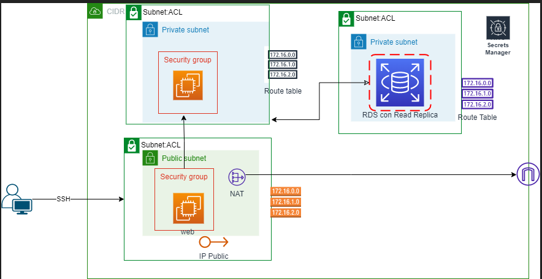

# Basic structure 
This project replicates a basic structure use in most projects of IaC, this repository pretend to be a help and to have a basic structure or template to start in any project which involves creating things such as: 
- VPC
- subnets
- KMS
- Secrets manager
- EC2 instances
- RDS 

The architecture used to create thhe project is


To deploy this architecture is mandatory to have the following software:
- [Terraform](https://www.terraform.io/downloads)
- [AWS CLI](https://docs.aws.amazon.com/cli/latest/userguide/getting-started-install.html)
- [GIT](https://git-scm.com/downloads)

In addition is necessary to configure AWS programmatic credentials using the following commands
```
  export AWS_ACCESS_KEY_ID=
  export AWS_SECRET_ACCESS_KEY=
```
To have access to AWS CLI.

Finally, to run the infraestructure, you have to run 
```
terrafom plan
terraform validate
terraform apply
```
To validate and apply the infraestructure. some things such as credentials, CIDR blocks, and others are hardcoded in variables.tf, if you need to change the default credentials you have to change the variable values using
```
terraform apply -var "instance_name=value"
```

## Some things to have in mind
- If you deploy the infraestrcuture, and then you use the command terrafom destroy, after all if you want to re-deploy you infraestructure, is necessary to change the name of secret, because when you delete a secret, it doesn't delete immediately, instead of that, it schedule a deletion.
- The SSH connection of the two instances have the same key, so you have to copy the key created in local machine to the public virtual machine, and then connect to the private virtual machine

Finally, the project have some outputs to use in case of needed